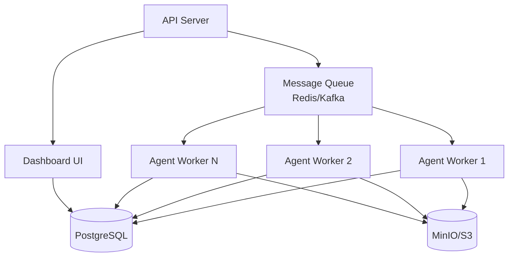

**Laddr** is an open-source multi-agent framework that helps developers build, orchestrate, and scale intelligent multi-agent systems with ease.

AI teams and developers around the world use Laddr to manage distributed agent systems, trace execution, and scale parallel tasks effortlessly.

---

## Why Laddr?

Building production-ready multi-agent systems is complex. You need:

- **Orchestration** - Coordinate multiple agents working together
- **Scalability** - Handle high throughput with parallel workers
- **Observability** - Track execution, debug issues, monitor performance
- **Flexibility** - Connect your own tools, APIs, and models
- **Reliability** - Handle failures, retries, and error recovery

Laddr provides all of this out of the box.

---

## Core Features

### Scalability

Queue-based architecture with parallel agent workers. Scale horizontally by adding more workers, or vertically by increasing worker capacity.

```bash
# Scale workers dynamically
laddr scale researcher 5
laddr scale coordinator 3
```

### Observability

Docker-based dashboard with real-time traces, token usage, and system metrics. Track every agent execution, tool call, and LLM interaction.

```bash
# Access dashboard
laddr run dev
# Open http://localhost:5173
```

### Extensibility

Connect your own tools, APIs, and external models with full control. Use MCP (Model Context Protocol), custom tools, or system tool overrides.

```python
from laddr import Agent
from laddr.core.mcp_tools import MCPToolProvider

mcp = MCPToolProvider(
    command="npx -y @modelcontextprotocol/server-filesystem /path",
    transport="stdio"
)

agent = Agent(
    name="filesystem_agent",
    tools=[mcp],
    # ... config
)
```

### Configurability

Flexible PostgreSQL and MinIO/S3 storage options. Choose your queue backend (Redis, Kafka, or in-memory), LLM provider, and storage backend.

```bash
# .env
QUEUE_BACKEND=redis
DB_BACKEND=postgresql
STORAGE_BACKEND=minio
LLM_PROVIDER=openai
```

### APIs

Exposed REST endpoints for jobs, traces, prompts, and system health. Integrate Laddr into your existing infrastructure.

```bash
# Submit a job
curl -X POST http://localhost:8000/api/prompts \
  -H "Content-Type: application/json" \
  -d '{
    "prompt_name": "researcher",
    "inputs": {"query": "Latest AI trends"}
  }'
```

---

## Architecture Overview

Laddr follows a distributed architecture pattern:



**Components:**

- **API Server** - REST API for submitting jobs and queries
- **Message Queue** - Task distribution (Redis, Kafka, or in-memory)
- **Agent Workers** - Execute agent tasks in parallel
- **Database** - Store traces, jobs, and metadata
- **Storage** - Store large artifacts and data
- **Dashboard** - Web UI for monitoring and debugging

---

## Quick Start

Get started with Laddr in under 60 seconds:

<CardGroup cols={2}>
  <Card
    title="Quickstart Guide"
    icon="rocket"
    href="/introduction/quickstart"
  >
    Run your first agent in 60 seconds
  </Card>
  <Card
    title="Installation"
    icon="download"
    href="/getting-started/install"
  >
    Set up Laddr on your machine
  </Card>
  <Card
    title="Key Features"
    icon="star"
    href="/introduction/key-features"
  >
    Explore Laddr's capabilities
  </Card>
  <Card
    title="API Reference"
    icon="code"
    href="/reference/api"
  >
    Integrate with REST API
  </Card>
</CardGroup>

---

## Next Steps

- [Quickstart Guide](/introduction/quickstart) - Run your first agent
- [Installation](/getting-started/install) - Set up Laddr
- [Key Features](/introduction/key-features) - Learn what Laddr can do
- [First Agent](/getting-started/first-agent) - Build your first agent
